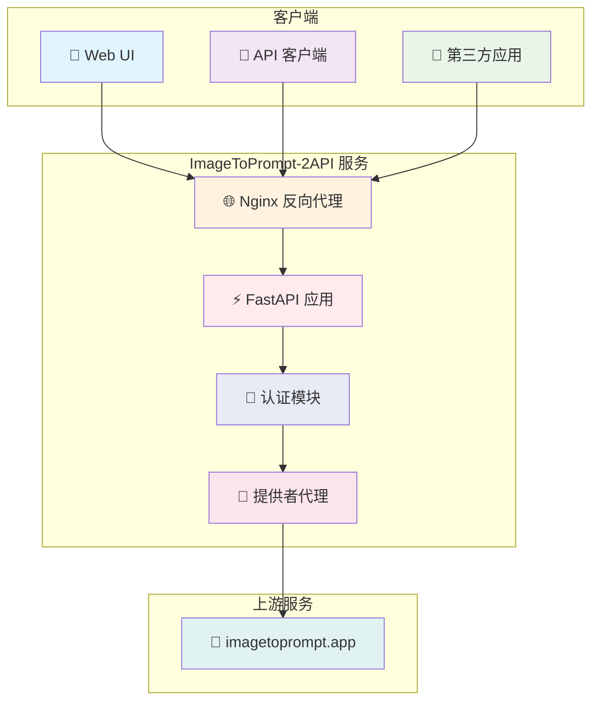
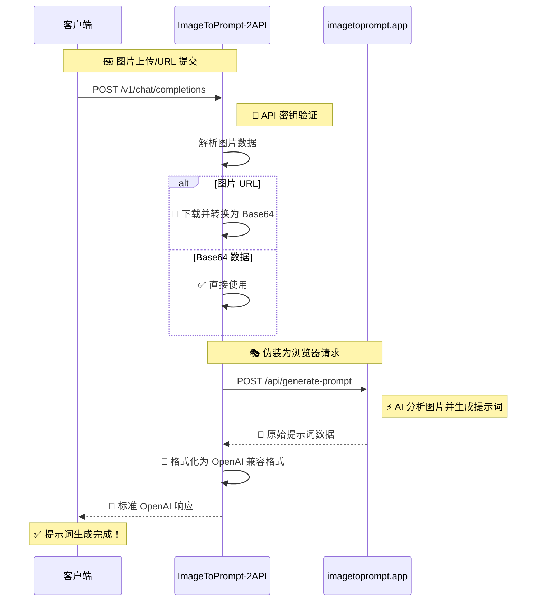
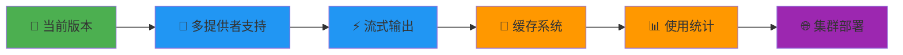

# 🎨 ImageToPrompt-2API: 你的免费 AI 逆向提示词工程师

<div align="center">

[](https://opensource.org/licenses/Apache-2.0)
 


> *"我们不是在编写代码，我们是在用逻辑和想象力，为世界增添一抹新的色彩。"*

**[访问 GitHub 仓库](https://github.com/lzA6/imagetoprompt-2api)**

</div>

## ✨ 核心特性

<div align="center">

| 🚀 开箱即用 | 🎯 OpenAI 兼容 | 🌍 多语言支持 |
|------------|----------------|--------------|
| Docker 一键部署 | 无缝对接现有生态 | 支持 11 种语言 |

| 🖼️ 多种输入 | 🎨 Web UI | 🔧 高度可扩展 |
|------------|-----------|--------------|
| URL 或 Base64 | 直观测试界面 | 模块化架构 |

</div>

## 🏗️ 系统架构



## 🚀 快速开始

### 环境要求

<div align="center">

| 组件 | 版本要求 | 备注 |
|------|----------|------|
| 🐳 Docker | 20.10+ | 推荐使用 Docker Desktop |
| 📦 Docker Compose | 2.0+ | 通常包含在 Docker Desktop 中 |
| 💻 操作系统 | Windows/macOS/Linux | 全平台支持 |

</div>

### 一键部署

**步骤 1：克隆项目**
```bash
git clone https://github.com/lzA6/imagetoprompt-2api.git
cd imagetoprompt-2api
```

**步骤 2：配置环境**
```bash
cp .env.example .env
# 编辑 .env 文件，设置你的 API 密钥和端口
```

**步骤 3：启动服务**
```bash
docker-compose up -d
```

**步骤 4：访问服务**
打开浏览器访问：`http://localhost:8088`

<div align="center">

🎉 **恭喜！服务已启动并运行！**

</div>

## 🔄 工作原理

### 核心流程



### 技术实现细节

1. **🔐 认证层**：基于 Bearer Token 的 API 密钥验证
2. **🔄 数据转换**：智能处理 URL 和 Base64 两种输入格式
3. **🎭 请求伪装**：模拟真实浏览器请求头，确保上游服务稳定性
4. **🎨 响应格式化**：将上游响应转换为标准 OpenAI 格式

## 🏗️ 技术架构深度解析

### 项目结构

```
imagetoprompt-2api/
├── 🐳 Docker 相关文件
│   ├── Dockerfile              # 应用容器配置
│   ├── docker-compose.yml      # 多服务编排
│   └── nginx.conf             # Web 服务器配置
├── 🔧 应用核心
│   ├── main.py                # FastAPI 应用入口
│   ├── requirements.txt       # Python 依赖
│   └── app/
│       ├── core/              # 核心配置
│       │   └── config.py      # 环境变量管理
│       ├── providers/         # 服务提供者
│       │   └── imagetoprompt_provider.py  # 上游 API 交互
│       └── utils/             # 工具函数
│           └── sse_utils.py   # 流式响应支持
├── 🎨 前端界面
│   └── static/
│       ├── index.html         # Web UI 主页面
│       ├── style.css          # 样式文件
│       └── script.js          # 交互逻辑
└── ⚙️ 配置文件
    ├── .env.example           # 环境变量模板
    └── .env                   # 实际环境配置
```

### 核心组件

#### 1. 🚀 FastAPI 应用 (`main.py`)

```python
# 关键技术特性：
# ✅ 全异步支持，高性能处理
# ✅ OpenAPI 自动文档生成
# ✅ 依赖注入系统
# ✅ 中间件支持
# ✅ 标准 OpenAI API 兼容

@app.post("/v1/chat/completions")
async def create_chat_completion(
    request: Request,
    # 🔐 自动 API 密钥验证
    _: str = Depends(verify_api_key)
):
    # 📥 处理多种格式的图片输入
    # 🎯 调用提供者服务
    # 📤 返回标准 OpenAI 格式响应
```

#### 2. 🔄 提供者服务 (`imagetoprompt_provider.py`)

```python
class ImageToPromptProvider:
    async def initialize(self):
        # 🚀 创建高性能 HTTP 客户端
        self.client = httpx.AsyncClient(timeout=30.0)
    
    async def url_to_data_uri(self, url: str) -> str:
        # 🌐 异步下载图片并转换为 Base64
        # ⚡ 支持超时和错误处理
    
    async def get_prompt_internal(self, image_data: str, language: str, 
                                 structured_prompt: bool) -> dict:
        # 🎭 设置浏览器级请求头
        # 📤 发送到上游 API
        # 🛡️ 完善的错误处理和重试机制
```

#### 3. 🐳 容器化部署

**Docker 架构：**
```yaml
services:
  app:
    build: .
    env_file: .env
    networks:
      - imagetoprompt-net
    
  nginx:
    image: nginx:latest
    ports:
      - "${NGINX_PORT:-8088}:80"
    volumes:
      - ./nginx.conf:/etc/nginx/nginx.conf:ro
    networks:
      - imagetoprompt-net
```

## 🎯 API 使用指南

### 基本请求示例

```python
import openai

# 配置客户端指向本地服务
client = openai.OpenAI(
    base_url="http://localhost:8088/v1",
    api_key="your_master_key_here"
)

# 通过 URL 生成提示词
response = client.chat.completions.create(
    model="image-to-prompt",
    messages=[{
        "role": "user",
        "content": [
            {"type": "text", "text": "请为这张图片生成提示词"},
            {"type": "image_url", "image_url": {"url": "https://example.com/image.jpg"}}
        ]
    }],
    max_tokens=1000
)

print(response.choices[0].message.content)
```

### 支持的语言

<div align="center">

| 语言代码 | 语言名称 | 状态 |
|----------|----------|------|
| `en` | English | ✅ 默认 |
| `zh-CN` | 简体中文 | ✅ 支持 |
| `zh-TW` | 繁體中文 | ✅ 支持 |
| `ja` | 日本語 | ✅ 支持 |
| `ko` | 한국어 | ✅ 支持 |
| `fr` | Français | ✅ 支持 |
| `de` | Deutsch | ✅ 支持 |
| `es` | Español | ✅ 支持 |
| `it` | Italiano | ✅ 支持 |
| `ru` | Русский | ✅ 支持 |
| `pt` | Português | ✅ 支持 |

</div>

## 💡 应用场景

<div align="center">

| 场景 | 描述 | 受益用户 |
|------|------|----------|
| 🎨 AI 绘画工作流 | 批量处理图片生成提示词 | AI 艺术家、设计师 |
| 📚 图库管理 | 自动为图片生成描述标签 | 摄影师、图库管理员 |
| 🤖 聊天机器人 | 集成到 Discord/Telegram 机器人 | 开发者、社区管理者 |
| 📖 学习研究 | 分析优秀图片的提示词构成 | AI 绘画学习者 |
| 🔄 二次创作 | 基于现有图片生成新变体 | 内容创作者 |

</div>

## 🚀 性能优化

### 当前性能指标

| 指标 | 数值 | 说明 |
|------|------|------|
| 🕒 响应时间 | 2-5 秒 | 主要取决于上游服务 |
| 🔄 并发支持 | 10+ 请求/秒 | 基于异步架构 |
| 🐳 资源占用 | ~200MB RAM | 轻量级容器 |
| ⏱️ 超时设置 | 30 秒 | 可配置 |

### 优化建议

1. **🔄 连接复用**：使用持久化 HTTP 连接
2. **💾 缓存层**：对相同图片实现结果缓存
3. **⚡ 异步处理**：全链路异步非阻塞
4. 🐳 资源限制：合理的容器资源限制

## 🔮 未来发展路线图



### 计划中的增强功能

1. **🔄 多提供者支持** 
   - 抽象提供者接口
   - 支持 BLIP、CLIP 等替代方案
   - 提供者故障自动切换

2. **⚡ 流式输出**
   - 模拟 OpenAI 流式响应
   - 实时生成体验
   - 支持 Server-Sent Events

3. **💾 智能缓存**
   - 基于图片哈希的缓存
   - Redis 分布式缓存支持
   - 可配置的缓存过期策略

## 🛠️ 故障排除

### 常见问题

<details>
<summary>❌ 服务启动失败</summary>

**可能原因：**
- 端口被占用
- Docker 服务未运行
- 环境变量配置错误

**解决方案：**
```bash
# 检查端口占用
netstat -tulpn | grep 8088

# 重启 Docker 服务
sudo systemctl restart docker

# 检查环境变量
cat .env | grep -v '^#'
```
</details>

<details>
<summary>🔑 API 认证失败</summary>

**可能原因：**
- API 密钥不匹配
- 请求头格式错误

**解决方案：**
```bash
# 检查 .env 文件中的 API_MASTER_KEY
# 确保请求头格式正确：
curl -H "Authorization: Bearer your_key" http://localhost:8088/v1/models
```
</details>

<details>
<summary>🌐 上游服务超时</summary>

**可能原因：**
- 网络连接问题
- 上游服务限流
- 图片过大

**解决方案：**
- 检查网络连接
- 减少并发请求
- 压缩图片大小
</details>

## 🤝 贡献指南

我们欢迎所有形式的贡献！无论是代码改进、文档完善，还是新功能建议。

### 如何贡献

1. 🍴 Fork 本项目
2. 🌿 创建特性分支 (`git checkout -b feature/AmazingFeature`)
3. 💾 提交更改 (`git commit -m 'Add some AmazingFeature'`)
4. 📤 推送分支 (`git push origin feature/AmazingFeature`)
5. 🔃 创建 Pull Request

### 开发环境设置

```bash
# 1. 克隆项目
git clone https://github.com/lzA6/imagetoprompt-2api.git
cd imagetoprompt-2api

# 2. 创建虚拟环境
python -m venv venv
source venv/bin/activate  # Windows: venv\Scripts\activate

# 3. 安装依赖
pip install -r requirements.txt

# 4. 设置环境变量
cp .env.example .env

# 5. 启动开发服务器
uvicorn main:app --reload --host 0.0.0.0 --port 8088
```

## 📜 开源协议

本项目采用 **Apache License 2.0** 开源协议。

**你可以：**
- ✅ 自由使用于商业项目
- ✅ 修改和分发代码
- ✅ 专利使用

**你需要：**
- 📝 保留原始许可证声明
- ℹ️ 声明代码修改

**详细条款请参阅：[Apache License 2.0](https://www.apache.org/licenses/LICENSE-2.0)**

---

<div align="center">

## 🌟 加入我们的社区

**你的每一颗 Star ⭐，都是对开源事业的支持！**

[](https://star-history.com/#lzA6/imagetoprompt-2api&Date)

**一起用代码创造美好！**

</div>
